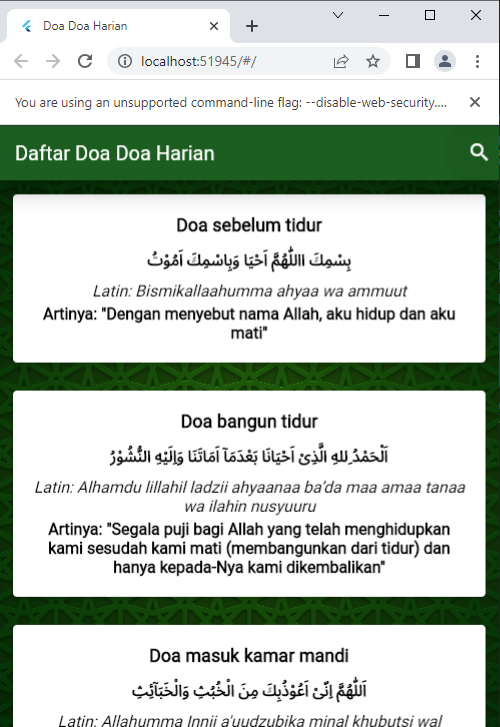

# **PEMOGRAMAAN Mobile**

**Nama :** _Dean Adriansyah Asy'ari_

**NIM :** _312110286_

**Kelas :** _TI.21.A2_

**Teknik Informatika - UNIVERSITAS PELITA BANGSA**

---

### Apa itu Flutter?
Flutter adalah sebuah kerangka kerja (framework) open-source yang dikembangkan oleh Google untuk membangun antarmuka pengguna (UI) yang konsisten, indah, dan responsif di berbagai platform seperti Android, iOS, web, dan desktop. Dengan menggunakan Flutter, seorang pengembang dapat membuat aplikasi yang memiliki performa tinggi dan tampilan menarik dengan cepat.

## soal UAS

- Buatlah Tampilan Flutter dengan API 
- Link Api yg diberikan 
- API yang digunakan 

## Tools

- Flutter : 
- Visual Studio Code : 
- Github : 

# 
Hasil Screenshot Flutter

- jika tekan logo search

---

# 
 THANK YOU SO MUCH FOR YOUR ATTENTION!! SEE YOU SOON!!

